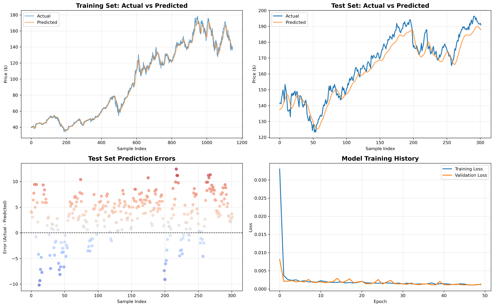
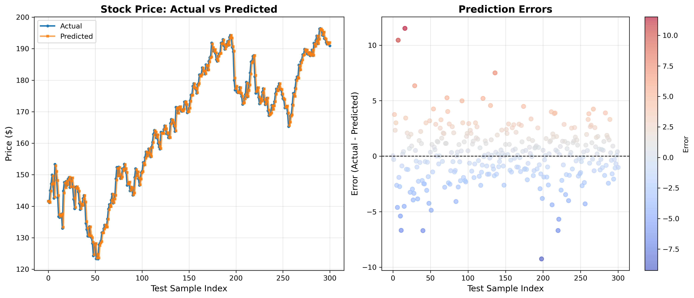
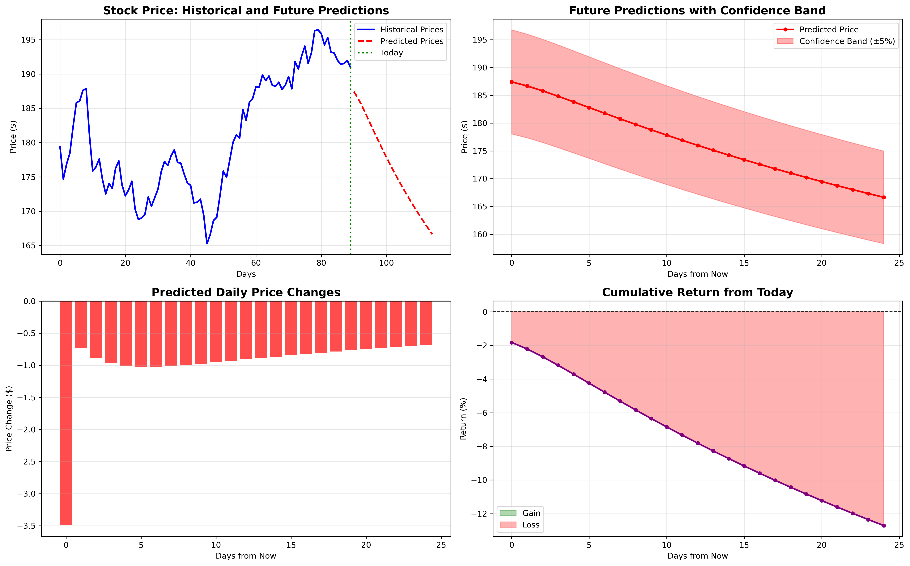
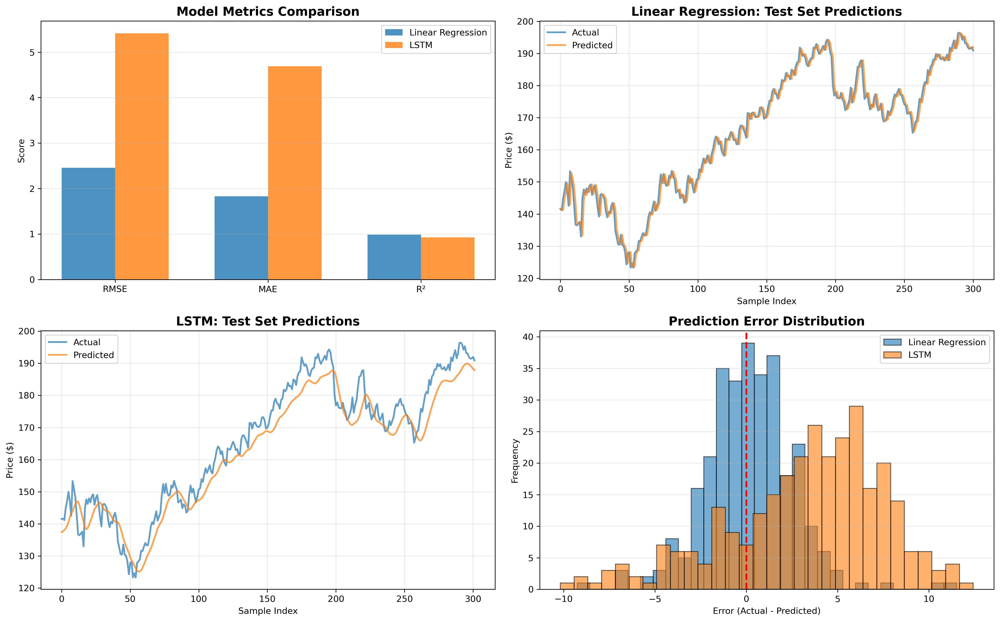

# 📈 Stock Price Prediction

This project builds and evaluates machine learning and deep learning models to predict future stock prices using historical stock market data. It demonstrates **data preprocessing, exploratory data analysis (EDA), feature engineering, and model training** with both traditional ML and deep learning (LSTM).

---

## 🚀 Project Overview

* **Goal:** Predict future stock closing prices based on historical stock data.
* **Dataset:** Historical stock prices (downloaded from **Yahoo Finance**).
* **Features Used:** `Open`, `High`, `Low`, `Close`, `Volume`.
* **Models Implemented:**

  * Linear Regression (baseline model)
  * Long Short-Term Memory (LSTM) neural network (time-series model)
  * live_data_prediction from yahoofinance
* **Evaluation Metrics:** RMSE (Root Mean Square Error), MAE (Mean Absolute Error), MSE, R².

---

## 📂 Project Structure

```
stock-price-prediction/
├─ data/                 
│   └─ aapl_stock.csv          # raw stock dataset
├─ notebooks/            
│   ├─ download_data.ipynb     # data collection
│   ├─ eda_stock.ipynb         # exploratory analysis
│   └─ live_prediction_stock.ipynb    # evaluation & plots
    ├─ linear_regression.ipynb         # evaluateion & plots 
│   └─ lstm_stock_prediction.ipynb    # evaluation & plots
├─ src/                  
│   ├─ preprocess.py
│   ├─ preprocess_lstm.py
│   ├─ train.py
│   ├─ train_lstm.py
│   ├─ evaluate.py
│   ├─ evaluate_lstm.py
│   ├─ predict.py
│   ├─ predict_future.py
│   └─ compare_models.py
├─ models/               
│   ├─ linear_regression.joblib
│   ├─ lstm_model.keras
│   ├─ lstm_best.keras
│   ├─ scaler.joblib
│   └─ lstm_scaler.joblib
├─ requirements.txt      
├─ environment.yml       # reproducible conda environment
├─ .gitignore
└─ README.md
```

## 📖 Explore the Project

* [Linear Regression Notebook](notebooks/linear_regression.ipynb)
* [LSTM Notebook](notebooks/lstm_stock_prediction.ipynb)
* [Model Comparison Notebook](notebooks/model_comparison.ipynb)
* [live_data_prediction](notebooks/live_data_prediction.ipynb)

---

---

## ⚙️ Setup Instructions

### 1. Clone the repository

```bash
git clone https://github.com/<your-username>/stock-price-prediction.git
cd stock-price-prediction
```

### 2. Create environment & install dependencies

```bash
conda create -n stockpred python=3.10
conda activate stockpred

...  3. Install independencies

pip install -r requirements.txt
```

---

## 🏋️ Training

Train **Linear Regression**:

```bash
python src/train.py
```

Train **LSTM**:

```bash
python src/train_lstm.py
```

---

## 📊 Evaluation

Evaluate **Linear Regression**:

```bash
python src/evaluate.py
```

Evaluate **LSTM**:

```bash
python src/evaluate_lstm.py
```

---

## 🔮 Prediction

Predict with **Linear Regression**:

```bash
python src/predict.py
```

Predict **future stock price with LSTM**:

```bash
python src/predict_future.py
```

---

## ⚖️ Model Comparison

Compare **Linear Regression vs LSTM**:

```bash
python src/compare_models.py
```

✅ This will output evaluation metrics (MSE, RMSE, MAE, R²) for both models side by side.

---

## 📊 Results
Linear Regression: Works as a simple baseline but cannot capture time dependencies.
LSTM: Performs better by learning sequential patterns in stock price movement.
Metrics and plots are available in notebooks/exploration.ipynb and comparison scripts.
### 🔹 Model Performance

| Model             | RMSE   |  MAE   | R^2
| ----------------- | ------ | ------ | ------
| Linear Regression | 2.4552 | 1.8310 | 0.9842
| LSTM              | 5.4242 | 5.6888 | 0.9233

✅ LSTM achieved **lower error** and captured time-series patterns better than linear regression.

---

### 🔹 Visualizations

**1. LSTM evaluation (LSTM)**


**2. Linear Regression Predictions**


**3. LSTM Future Forecast**


**3. model comparison**


---

## 🔍 Key Learnings

* Handling time-series data (scaling, sequence creation).
* Comparing classical ML (Linear Regression) vs deep learning (LSTM).
* Building a reproducible ML pipeline (preprocessing → training → evaluation → prediction).

---


## 🛠 Reproducibility

Export the environment to share:

```bash
conda env export > environment.yml
```

Recreate with:

```bash
conda env create -f environment.yml
```

---

## 📌 Future Improvements

* Add more advanced models (Prophet, Transformer-based models).
* Tune LSTM hyperparameters for better forecasting.
* Extend to multiple stocks with user input.
* Deploy as a web app (Flask/FastAPI + Docker).

---

## 👤 Author

* **Temoor Hussain**
  📧 Email: [your-email@example.com](mailto:temoorh48@gmail.com)
  🔗 GitHub: [Temoor-49](https://github.com/Temoor-49)
